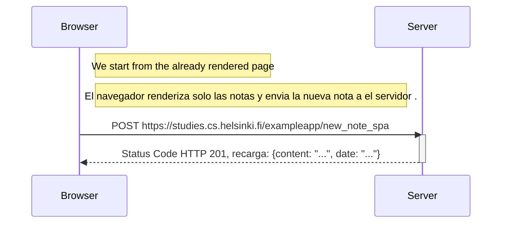

```mermaid
 sequenceDiagram
    participant Browser
    participant Server

    Note right of Browser: We start from the already rendered page

    Note right of Browser: El navegador renderiza solo las notas y envia la nueva nota a el servidor .
    Browser->>Server: POST https://studies.cs.helsinki.fi/exampleapp/new_note_spa
    activate Server
    Server-->>Browser: Status Code HTTP 201, recarga: {content: "...", date: "..."}
    deactivate Server

    
```